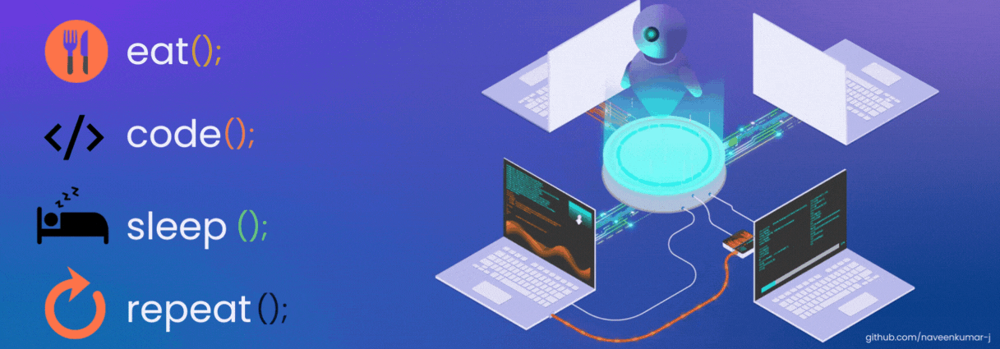

  

<h1 align="center">👋 Hi, I'm Matthew</h1>
<h3 align="center">An AI Developer passionate about Machine Learning and Computer Vision</h3>

---

  🎯 I'm an AI Developer who loves <strong>Machine Learning</strong> and <strong>Computer Vision</strong>. 
  🌱 Currently diving deeper into <strong>Deep Learning</strong> and <strong>Data Science</strong>. 
  🚀 I build smart systems using AI tools and models.

---

<table align="center">
  <tr>
    <td>
      <h3>💻 Programming Languages</h3>
      <ul>
        <li>C#</li>
        <li>PHP</li>
        <li>HTML</li>
        <li>SQL</li>
        <li>R</li>
        <li>Python</li>
      </ul>
    </td>
    <td>
      
    </td>
  </tr>
</table>

---
<h3 align="center">🧠 My AI & ML Skills</h3>

  <!-- Deep Learning -->
  
  
  

  <!-- Computer Vision -->
  
  
  

  <!-- Data Science -->
  
  
  

---

<h3>📫 Let's Connect</h3>

  
  
  

